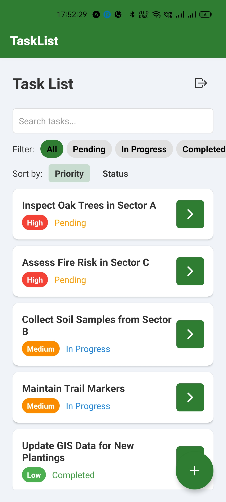
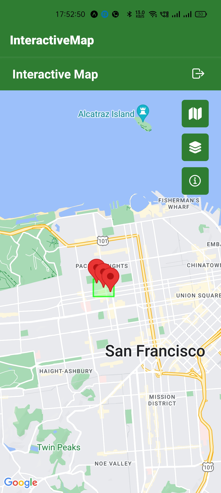
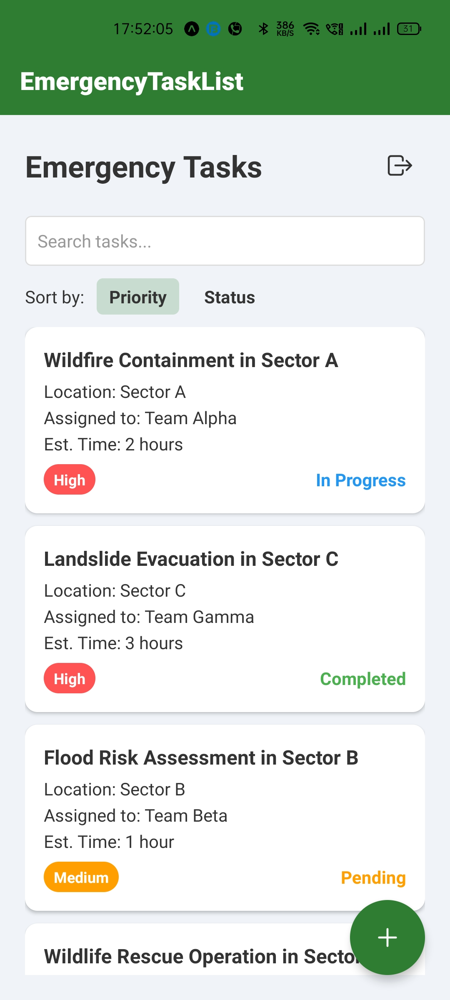
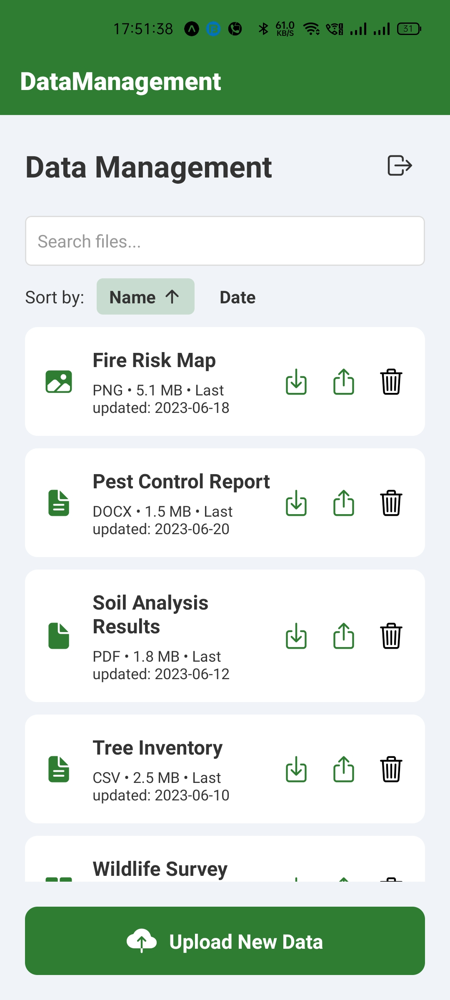
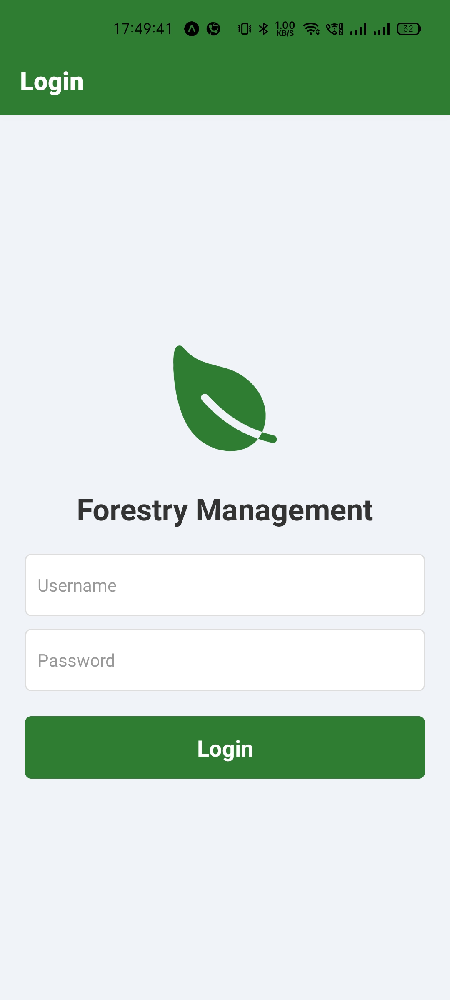

# Forestry Management Mobile App

A React Native mobile application designed to optimize forestry operations. The app offers tailored dashboards and functionalities for various personas involved in forest management, including Forestry Managers, Field Operatives, GIS Specialists, Emergency Response Coordinators, and Administrators. The design incorporates nature-inspired aesthetics with earthy tones, forestry-themed icons, and dynamic AI insights, providing a smooth and highly interactive user experience.

## Table of Contents
- [Features](#features)
- [Personas](#personas)
- [Screens and Pages](#screens-and-pages)
- [Design and Themes](#design-and-themes)
- [AI Integration](#ai-integration)
- [Navigation](#navigation)
- [Static Data](#static-data)
- [Future Integration Considerations](#future-integration-considerations)
- [Setup Instructions](#setup-instructions)
- [Credits](#credits)
- [License](#license)

## Features
- Login Screen: Dynamic login flows for each persona with subtle forestry animations.
- Persona-based Dashboards: Customized insights, charts, and statistics relevant to each role.
- Role-Specific Pages: Tailored pages for work orders, inspections, tasks, GIS maps, emergency management, and user/system management.
- Forestry-themed UI: Use of natural colors, forestry icons, and subtle animations to enhance user experience.
- AI-Powered Insights: Simulated AI button for each persona offering insights and recommendations.
- Real-time Interactivity: Buttons trigger real-time popups and updates to simulate dynamic data handling.
- Responsive Design: Mobile-friendly and responsive across devices.

## Personas

### 1. Forestry Manager

- Dashboard: Overview of tasks, work orders, team status, upcoming inspections.
- Work Order Management: List of work orders, with details and static data.
- Inspection Overview: Pie charts, bar charts, and status tracking for ongoing inspections.
- Team Assignment: Assign tasks and track team availability.

### 2. Field Operative

- Task List: Overview of assigned tasks with priority markers and due dates.
- Inspection Form: Ability to submit inspection reports with static data (tree status, hazards).

### 3. GIS Specialist

- Interactive Map View: GIS layers for tree inventory and inspections, with static markers for inspections and heatmaps.
- Data Management: Manage various GIS datasets representing forestry zones, species distribution, etc.

### 4. Emergency Response Coordinator

- Emergency Task List: Overview of emergencies (e.g., storm alerts, wildfire risks) with operatives assigned.
- Emergency Resources: List of resources and deployment functionality.

### 5. Administrator

- User Management: Add, update, or remove users with role assignment.
- System Health Check: Static graphs for app performance, uptime, and response time.

## Screens and Pages

### Login Screen
Each persona has a distinct login flow with customized nature animations (e.g., swaying leaves, growing trees).



### Persona Dashboards
Each persona dashboard is uniquely themed with charts and insights relevant to their role.

- Forestry Manager: Task completion status, upcoming inspections, and work order insights.
- Field Operative: Task list and offline sync status.
- GIS Specialist: Interactive map with GIS data layers and markers.

### Role-Specific Pages
Each persona has access to specific pages:
- Forestry Manager: Work orders, inspections, team assignment.
- Field Operative: Task list, inspection form.
- GIS Specialist: Map view, data management.
- Emergency Response Coordinator: Emergency tasks and resources.
- Administrator: User management, system health.

## Design and Themes

The app uses a forestry-themed design with the following elements:
- Color Palette: Earthy tones like forest green, brown, and neutral gradients.
- Typography: Rustic, bold, yet modern fonts that evoke a natural feel.
- Icons: Custom forestry-related icons (e.g., trees, leaves, inspection markers).
- Animations: Subtle animations like trees growing and leaves falling for transitions.

## AI Integration

The app includes a simulated AI button for each persona, which provides relevant insights. For example:
- Forestry Manager: "AI predicts a 20% increase in work orders next month."
- Emergency Response Coordinator: "AI suggests deploying resources to high-risk zones."

## Navigation

The app uses React Navigation for smooth transitions between pages:
- Personas can switch between roles, triggering a change in theme and dashboard.
- Users can access key pages (Map View, Task List, Work Orders) from the dashboard.

## Static Data

The app currently uses static placeholders for all data points, which will be replaced by dynamic API calls in future iterations. Mock API calls are used to simulate data interaction in the frontend.

## Future Integration Considerations
- Dynamics 365 Integration: Placeholder APIs have been used in this version, but future updates will integrate with Dynamics 365 for real-time work order, task, and team data.
- AI-Driven Insights: AI predictions for forestry management will be integrated with real data once backend integration is complete.

## Setup Instructions

1. Clone the Repository:
   ```bash
   git clone https://github.com/your-repo/forestry-management-app.git
   cd forestry-management-app

2. Install Dependencies:
npm install
# or
yarn install

3.Run the App:
npm run start
npm run android   # For Android
npm run ios       # For iOS (MacOS only)

4.Login Credentials:

Forestry Manager: manager/ password
Field Operative: operative/ password
GIS Specialist: gis/ password
Emergency Coordinator: coordinator/ password
Administrator: admin/ password

Mock Data
The app uses static data placeholders. No live data integration is required for now.

Credits
This app is developed as part of the Forestry Management Mobile App project inspired by modern forestry operations. The UI/UX design draws from real-world forestry management practices and incorporates insights gained from industry professionals.

Special thanks to contributors and collaborators who have provided valuable feedback and support.

License
This project is licensed under the MIT License. See the LICENSE file for details.


This `README.md` file includes references to images located in the `img` folder, which are structured according to your file setup. Make sure that the image paths match the structure shown in your repository.
